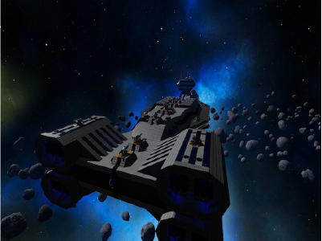

<!DOCTYPE HTML>
<html lang="en">

<head>
	<meta charset="utf-8">
	<title>Maxim - Modern One Page Bootstrap Template</title>
	<meta name="viewport" content="width=device-width, initial-scale=1.0">
	<meta name="description" content="">
	<meta name="author" content="">
	<link href="css/bootstrap-responsive.css" rel="stylesheet">
	<link href="css/style.css" rel="stylesheet">
	<link href="color/default.css" rel="stylesheet">
	<link rel="shortcut icon" href="img/favicon.ico">
	<!-- =======================================================
    Theme Name: Maxim
    Theme URL: https://bootstrapmade.com/maxim-free-onepage-bootstrap-theme/
    Author: BootstrapMade.com
    Author URL: https://bootstrapmade.com
	======================================================= -->
</head>

<body>
	<!-- navbar -->
	

		

			

				

					<!-- Responsive navbar -->
					<a class="btn btn-navbar" data-toggle="collapse" data-target=".nav-collapse">
				</a>
					<h1 class="brand"><a href="index.html">Universo Gamer</a></h1>
					<!-- navigation -->
					<nav class="pull-right nav-collapse collapse">
						<ul id="menu-main" class="nav">
							<li><a title="team" href="#about">About</a></li>
							<li><a title="services" href="#services">Services</a></li>
							<li><a title="works" href="#works">Works</a></li>
							<li><a title="blog" href="#blog">Blog</a></li>
							<li><a title="contact" href="#contact">Contact</a></li>
							<li><a href="page.html">Page</a></li>
						</ul>
					</nav>
				

			

		

	

	<!-- Header area -->
	

		<header class="clearfix">
			

				
			

			

				

					

						

							<ul class="slides">
								<li>
									

										<strong>Bienvenido a nuestro portal</strong>
									

								</li>
								<li>
									

									<strong>Bienvenido a nuestro portal</strong>
									

								</li>
								<li>
									

									<strong>Bienvenido a nuestro portal</strong>
									

								</li>
							</ul>
						

						<!-- end slider -->
					

				

			

		</header>
	

	<!-- spacer section -->
	<section class="spacer green">
		

			

				

					<blockquote class="large">
						La posibilidad de realizar un sueño es lo que hace que la vida sea interesante <cite></cite>
					</blockquote>
				

				

					<i class="icon-coffee icon-10x"></i>
				

			

		

	</section>
	<!-- end spacer section -->
	<!-- section: team -->
	<section id="about" class="section">
		

			<h4>Quienes Somos</h4>
			

				

					

						<h2>Universo<strong></strong>Gamer</h2>
						

					Somos una empresa especializadas en la parte de la elaboracion de videojuegos,
					paginas web entre otras cosas relacionadas sobre la programacion, una empresa 
					que desde sus inicios se ha dedicado siempre a proveer y equipar con sistemas 
					a las principales empresas y organizaciones.
						

					

				

				

					

						
					

				

			

			

				

					

						
						<h3>Angela Peralda Mayo Mendez</h3>
						

							Director
						

					

				

				

					

						
						<h3>Julio Cesar Martinez Garcia</h3>
						

							Web developer
						

					

				

				

					

						
						<h3>Jose Alberto Moreno Cuervo</h3>
						

							Web designer
						

					

				

					

				

			

		

		<!-- /.container -->
	</section>
	<!-- end section: team -->
	<!-- section: services -->
	<section id="services" class="section orange">
		

			<h4>Servicios</h4>
			<!-- Four columns -->
			

				

					

						
						<h2>Diseñadores de juego</h2>
						

							Control de Calidad Probar los Juegos de una Manera Sistemática Identificar problemas, sugerir mejoras y Documentar esto Analizar el Rendimiento del Juego Funciones Capacidades y conocimiento Rutas típicas de Carrera y Formación Gestión de Personas, Tiempo y Recursos.
						

					

				

				

					

						
						<h2>Programadores</h2>
						

							Programador de Gráficos Escribir el Código que Controla el Juego Diseñar de las Especificaciones Técnicas para el Juego Incorpora y Adapta las Partes Hechas Probar y Corregir los Errores Funciones Capacidades y conocimiento Rutas típicas de Carrera.
						

					

				

				

					

						
						<h2>Modelado y Animacion 3D</h2>
						

								Especialización en edición 3D o 2D.Crea bocetos y esquemas de color de los mundos, personajes, vehiculos, etc. Funciones Capacidades y conocimiento Rutas típicas de Carrera y Formación Creatividad para Resolver Problemas Técnicos Gráficos 3D Organización Arquitectura de las plataformas.
						

					

				

				

					

						
						<h2>Paginas Web</h2>
						

							Especializacion en la edicion de la pagina Web y
							formacion creatividad para resolver problemas
						

					

				

			

		

	</section>
	<!-- end section: services -->
	<!-- section: works -->
	<section id="works" class="section">
		

			<h4>Our Works</h4>
			<!-- portfolio filter -->
			

				

					<ul class="clearfix">
						<li>
							<a href="#" data-filter="*" class="active">
								<h5>All</h5>
							</a>
						</li>
						<li>
							<a href="#" data-filter=".web">
								<h5>Web</h5>
							</a>
						</li>
						<li>
							<a href="#" data-filter=".print">
								<h5>Print</h5>
							</a>
						</li>
						<li>
							<a href="#" data-filter=".design">
								<h5>Design</h5>
							</a>
						</li>
						<li>
							<a href="#" data-filter=".photography">
								<h5>Photography</h5>
							</a>
						</li>
					</ul>
				

				<!-- END PORTFOLIO FILTERING -->
			

			

				

					

						<!-- portfolio item -->
						

							

								<a href="img/works/big.jpg" data-pretty="prettyPhoto[gallery1]" class="portfolio-image">
						
						

							

								<h5>Portfolio name</h5>
								<i class="icon-plus icon-2x"></i>
							

						

						</a>
							

						

						<!-- end portfolio item -->
						<!-- portfolio item -->
						

							

								<a href="img/works/big.jpg" data-pretty="prettyPhoto[gallery1]" class="portfolio-image">
						
						

							

								<h5>Portfolio name</h5>
								<i class="icon-plus icon-2x"></i>
							

						

						</a>
							

						

						<!-- end portfolio item -->
						<!-- portfolio item -->
						

							

								<a href="img/works/big.jpg" data-pretty="prettyPhoto[gallery1]" class="portfolio-image">
						
						

							

								<h5>Portfolio name</h5>
								<i class="icon-plus icon-2x"></i>
							

						

						</a>
							

						

						<!-- end portfolio item -->
						<!-- portfolio item -->
						

							

								<a href="img/works/big.jpg" data-pretty="prettyPhoto[gallery1]" class="portfolio-image">
						
						

							

								<h5>Portfolio name</h5>
								<i class="icon-plus icon-2x"></i>
							

						

						</a>
							

						

						<!-- end portfolio item -->
						<!-- portfolio item -->
						

							

								<a href="img/works/big.jpg" data-pretty="prettyPhoto[gallery1]" class="portfolio-image">
						
						

							

								<h5>Portfolio name</h5>
								<i class="icon-plus icon-2x"></i>
							

						

						</a>
							

						

						<!-- end portfolio item -->
						<!-- portfolio item -->
						

							

								<a href="img/works/big.jpg" data-pretty="prettyPhoto[gallery1]" class="portfolio-image">
						
						

							

								<h5>Portfolio name</h5>
								<i class="icon-plus icon-2x"></i>
							

						

						</a>
							

						

						<!-- end portfolio item -->
						<!-- portfolio item -->
						

							

								<a href="img/works/big.jpg" data-pretty="prettyPhoto[gallery1]" class="portfolio-image">
						
						

							

								<h5>Portfolio name</h5>
								<i class="icon-plus icon-2x"></i>
							

						

						</a>
							

						

						<!-- end portfolio item -->
						<!-- portfolio item -->
						

							

								<a href="img/works/big.jpg" data-pretty="prettyPhoto[gallery1]" class="portfolio-image">
						
						

							

								<h5>Portfolio name</h5>
								<i class="icon-plus icon-2x"></i>
							

						

						</a>
							

						

						<!-- end portfolio item -->
						<!-- portfolio item -->
						

							

								<a href="img/works/big.jpg" data-pretty="prettyPhoto[gallery1]" class="portfolio-image">
						
						

							

								<h5>Portfolio name</h5>
								<i class="icon-plus icon-2x"></i>
							

						

						</a>
							

						

						<!-- end portfolio item -->
						<!-- portfolio item -->
						

							

								<a href="img/works/big.jpg" data-pretty="prettyPhoto[gallery1]" class="portfolio-image">
						
						

							

								<h5>Portfolio name</h5>
								<i class="icon-plus icon-2x"></i>
							

						

						</a>
							

						

						<!-- end portfolio item -->
					

				

			

		

	</section>
	<!-- spacer section -->
	<section class="spacer bg3">
		

			

				

					<blockquote class="large">
						Lo que te hace unico, te hace exitoso.
					</blockquote>
				

				

					<i class="icon-rocket icon-10x"></i>
				

			

		

	</section>
	<!-- end spacer section -->
	<!-- section: blog -->
	<section id="blog" class="section">
		

			<h4>Empresa</h4>
			<!-- Three columns -->
			

				

					

						

							
						

						

							<i class="icon-file icon-2x"></i>
							April 19, 2018
							<a href="#">Objetivo</a>, 
						

						

							<h5><strong><a href="#">Objetivo</a></strong></h5>
							

								Brindar soluciones integrales de comunicaciones apostando a productos de reconocida trayectoria así como a nuevas tecnologías. Mantener un contacto personalizado, profesional y cordial con cada uno de nuestros clientes. &hellip;
							

							<a href="#" class="more">Read more</a>
						

					

				

				

					

						

							
						

						

							<i class="icon-file icon-2x"></i>
							April 19, 2018
							<a href="#">Vision</a>, 
						

						

							<h5><strong><a href="#">Vision</a></strong></h5>
							

								Nuestra visión es convertirnos en la principal empresa referente en la programacion. Obtener el reconocimiento de todos nuestros clientes. Aportar innovación tecnológica a nuestra sociedad así como un ejemplo de buen servicio y rentabilidad. &hellip;
							

							<a href="#" class="more">Read more</a>
						

					

				

				

					

						

							
						

						

							<i class="icon-file icon-2x"></i>
							April 19, 2018
							<a href="#">Mision</a>, 
						

						

							<h5><strong><a href="#">Mision</a></strong></h5>
							

								Nuestra misión es crear videojuegos a nuestros clientes.s Dar lo mejor de nosotros para lograr estar a la altura de la prestigiosa marca que representamos, con la cual nos sentimos muy identificados. &hellip;
							

							<a href="#" class="more">Read more</a>
						

					

				

				

					

						

							
						

						

							<i class="icon-file icon-2x"></i>
							April 19, 2018
							<a href="#">Valores</a>, 
						

						

							<h5><strong><a href="#">Valores</a></strong></h5>
							

								Honestidad,
								Responsabilidad,
								Vocacion de servicio,
								Iniciativa,
								Puntualidad,
								Compromiso,
								Disponibilidad &hellip;
							

							<a href="#" class="more">Read more</a>
						

					

				

			

			

			

				<a href="#" class="btn btn-large btn-theme">More blog post</a>
			

		

	</section>

	<!-- end spacer section -->
	<!-- section: contact -->
	<section id="contact" class="section green">
		

			<h4>Contacto</h4>
			

			

			

			

			

				

					

						
Your message has been sent. Thank you!

						

						<form action="" method="post" role="form" class="contactForm">
							

								

									

										<input type="text" name="name" class="form-control" id="name" placeholder="Your Name" data-rule="minlen:4" data-msg="Please enter at least 4 chars" />
										

									

									

										<input type="text" class="form-control" name="email" id="email" placeholder="Your Email" data-rule="email" data-msg="Please enter a valid email" />
										

									

									

										<input type="text" class="form-control" name="subject" id="subject" placeholder="Subject" data-rule="minlen:4" data-msg="Please enter at least 8 chars of subject" />
										

									

								

								

									

										<textarea class="form-control" name="message" rows="5" data-rule="required" data-msg="Please write something for us" placeholder="Message"></textarea>
										

									

									<input type="submit" value="Send message" class="btn btn-theme pull-left">
								

							

						</form>
					

				

				<!-- ./span12 -->
			

		

	</section>
	<footer>
		

			

				

					<ul class="social-networks">
						<li><a href="#"><i class="icon-circled icon-bgdark icon-instagram icon-2x"></i></a></li>
						<li><a href="#"><i class="icon-circled icon-bgdark icon-twitter icon-2x"></i></a></li>
						<li><a href="#"><i class="icon-circled icon-bgdark icon-dribbble icon-2x"></i></a></li>
						<li><a href="#"><i class="icon-circled icon-bgdark icon-pinterest icon-2x"></i></a></li>
					</ul>
					

						&copy; Maxim Theme. All rights reserved.
						

							<!--
                All the links in the footer should remain intact.
                You can delete the links only if you purchased the pro version.
                Licensing information: https://bootstrapmade.com/license/
                Purchase the pro version with working PHP/AJAX contact form: https://bootstrapmade.com/buy/?theme=Maxim
              -->
							<a href="https://bootstrapmade.com/">Free Bootstrap Templates</a> by BootstrapMade.com
						

					

				

			

		

		<!-- ./container -->
	</footer>
	<a href="#" class="scrollup"><i class="icon-angle-up icon-square icon-bgdark icon-2x"></i></a>
	
	
	
	
	
	
	
	
	
	
	
	

</body>

</html>
